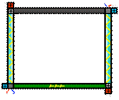

# E cube
ジャンル「2人対戦パズルゲーム」

制作期間：10日間

制作時期：平成26年2月頃から

## ソース・ヘッダーファイルと簡単な説明
- **graphic.h/.cpp**  
オブジェクトの表示などに使う関数を用意

- **input.h/.cpp**  
キーボードでの入力受付

- **main.h/.cpp**  
メインルーチン、メッセージ処理

- **game.h/.cpp**  
メインゲームの制御

- **scene.h/.cpp**  
タイトル、キャラセレクト、メインゲーム、

- **Result.h/.cpp**  
メインゲームの結果表示

- **read_file.h/.cpp**  
ブロックの配置用テーブルファイルの読み込み用

- **Lib.h**  
プリプロ関連ヘッダーファイル、多用する定数など

## 最も工夫した箇所
- 「graphic.cpp」の417行目から606行目までの描画用関数です。  
よく使うテクスチャの頂点の変形パターン別の関数を複数用意し、パズルの回転表示や、プレイヤーのアニメーション表示に対応出来るように作りました。

- 「read_file.cpp」のファイルを読み込みは、ブロック用の配列に仮保存する処理をし、メインゲーム中にその配列データを使えるように作りました。  
パズルゲームということもあり、「read_file.cpp」のファイル読み込みは企画者に外部ファイルを渡してブロック配置を決めてもらい、アニメーション担当の方に使いやすくと思い作った、「graphic.cpp」の頂点の変形パターン別関数の2つは作業分担が出来て、このチーム制作において最も役に立てた所です！                                          　　

## この時の制作について
このチーム制作は今までの制作の中で最もチームとしての一体感を感じることが出来ました。  
私以外のプログラマは学校内でもかなり出来る方々でした。  
単純にプログラム力が平均的に高かった事もありますが、1～2週間という期間での制作だったため、毎日朝から晩まで皆で集まってコーディングをしていました。  
マスターギリギリでバグが見つかった時には、チーム全員でカラオケで徹夜してバグを取り、+αの実装もできました。

## ゲームルール
1対1の対人パズルゲームです。基板の中のパネルの配線を正しく繋ぎ、基板に電気を通して相手に魔法攻撃！相手の体力ゲージを無くした方が勝ちです！

↓ 「基板」  
  
↑基板の両端のカラフルなバーが「電源」

↓5色の色が付いているのが「パネル」  
  
↑黒い溝のようなものが「配線」

### パネルに電気が通る（攻撃可能になる）しくみ
右側から左側の電源が配線でつながっている際にパネルが光り、相手に攻撃が可能になります。

## 操作方法
### タイトル
- **↑↓キー**  
ゲーム開始or終了の選択

- **Enterキー**  
決定

### キャラセレクト
||1P|2P|
|-|-|-|
|キャラ選択(男女)|A・Dキー|←・→キー|
|キャラ決定|Zキー |Kキー|
|キャラ決定解除|Xキー|Lキー|

- **Enterキー**  
ゲーム開始(両プレイヤーがキャラを選択済の状態のみ)

### 対戦中
||1P|2P|
|-|-|-|
|動かすパズルのカーソル移動|A・D・W・Sキー|←・↓・↑・→キー|
|パズルの左・右回転|Z・Xキー|K・Lキー|
|基板(パズル)の交換|Cキー|Mキー|
|攻撃！(パズルが点灯している時のみ)|Vキー|Oキー|

### リザルト
- **↑↓キー**  
対戦リトライorキャラ選択orタイトルの選択

- **Enter・Spaceキー**  
決定 
